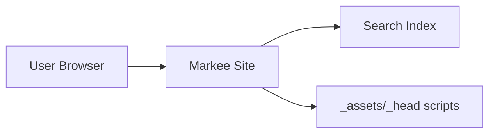

---
plugins:
  tabbedContent:
    linkTabs: false
---

# Diagrams

The `@markee/diagrams` extension renders diagram fences directly in the browser.

Supported fence languages:

- `mermaid` (rendered with Mermaid)
- `dbml` (converted to DOT with `@softwaretechnik/dbml-renderer`, then rendered with `d3-graphviz`)

## Usage

Add the extension to your `markee.yaml`:

```yaml
extensions:
  - '@markee/diagrams'
```

## Mermaid fences

Write any Mermaid definition in a `mermaid` fence.

:::tab[Example: Mermaid]



:::
:::tab[Source]

~~~md

~~~

:::

## DBML fences

Write a DBML schema in a `dbml` fence.

:::tab[Example: DBML]

```dbml
Table users {
    id integer
    username varchar
    role varchar
    created_at timestamp
}

Table posts {
    id integer [primary key]
    title varchar
    body text [note: 'Content of the post']
    user_id integer
    status post_status
    created_at timestamp
}

Enum post_status {
    draft
    published
    private [note: 'visible via URL only']
}

Ref: posts.user_id > users.id // many-to-one
```

:::
:::tab[Source]

~~~md

~~~

:::

## Interoperability with Kroki

If you also use `@markee/kroki`, fences with `kroki` meta are left untouched by this extension.
This keeps existing server-rendered blocks working:

~~~md

~~~

## Lightbox support

Lightbox is enabled by default (following your global Lightbox plugin configuration).

Disable Lightbox for one fence with `lightbox=false` in fence meta:

~~~md
```dbml lightbox=false
Table users {
  id integer [pk]
}
```
~~~

You can also use the same class aliases as other extensions:

- disable: `.skip-lightbox` or `.off-glb`
- force-enable: `.force-lightbox` or `.on-glb`

## Fence meta passthrough

`id` and `class` metadata from the fence are forwarded to the generated `markee-diagram` element.
