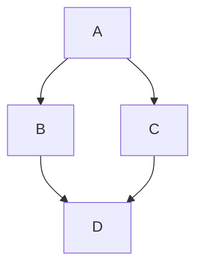

---
plugins:
  tabbedContent:
    linkTabs: false
---

# Kroki

The **Kroki** Markee extension enables the usage of **Kroki**
as a rendering backend for diagrams.

Since Kroki renders the diagrams on a server, you will need to
configure the Kroki server URL in your `markee.yaml` file
in the `plugins.kroki.serverUrl` field.

You can then use any diagram engine supported by your Kroki server
by using a code block with `<engine> kroki` as the language.

## Pre-render during build

This extension provides an optional build-time plugin that can pre-render diagrams during build, removing
the need to call the Kroki server during client rendering.

You can opt-in for this feature by setting the `plugins.kroki.prerender` option to `true`.

Diagrams are pre-rendered as SVG and inlined directly in the built Markdown files, without the need for any storage 
solution for the generated artifacts.

## Examples

:::tab[Example: Mermaid]



:::
:::tab[Source]

~~~md

~~~

:::

---

:::tab[Example: PlantUML]

```plantuml kroki
Bob -> Alice : hello
```

:::
:::tab[Source]

~~~md

~~~

:::

---

:::tab[Example: C4 PlantUML]
```c4plantuml kroki
@startuml
!include C4_Context.puml

LAYOUT_WITH_LEGEND()

title System Context diagram for Internet Banking System

Person(customer, "Personal Banking Customer", "A customer of the bank, with personal bank accounts.")
System(banking_system, "Internet Banking System", "Allows customers to view information about their bank accounts, and make payments.")

System_Ext(mail_system, "E-mail system", "The internal Microsoft Exchange e-mail system.")
System_Ext(mainframe, "Mainframe Banking System", "Stores all of the core banking information about customers, accounts, transactions, etc.")

Rel(customer, banking_system, "Uses")
Rel_Back(customer, mail_system, "Sends e-mails to")
Rel_Neighbor(banking_system, mail_system, "Sends e-mails", "SMTP")
Rel(banking_system, mainframe, "Uses")
@enduml
```
:::
:::tab[Source]

~~~md

~~~

:::

---

:::tab[Example: dbml]

```dbml kroki
Table users {
    id integer
    username varchar
    role varchar
    created_at timestamp
}

Table posts {
    id integer [primary key]
    title varchar
    body text [note: 'Content of the post']
    user_id integer
    status post_status
    created_at timestamp
}

Enum post_status {
    draft
    published
    private [note: 'visible via URL only']
}

Ref: posts.user_id > users.id // many-to-one
```

:::
:::tab[Source]

~~~md

~~~

:::

---

:::tab[Example: SeqDiag]

```seqdiag kroki
seqdiag {
  browser  -> webserver [label = "GET /index.html"];
  browser <-- webserver;
  browser  -> webserver [label = "POST /blog/comment"];
  webserver  -> database [label = "INSERT comment"];
  webserver <-- database;
  browser <-- webserver;
}
```

:::
:::tab[Source]

~~~md

~~~

:::

---

:::tab[Example: Excalidraw]

```excalidraw kroki
{
  "type": "excalidraw",
  "version": 2,
  "source": "https://excalidraw.com",
  "elements": [
    {
      "id": "dQf8rmaac24MMAE7lYh8u",
      "type": "rectangle",
      "x": 846.0802836976803,
      "y": -2283.2104265942703,
      "width": 164.7577360968348,
      "height": 45,
      "angle": 0,
      "strokeColor": "#1e1e1e",
      "backgroundColor": "#cccccc",
      "fillStyle": "hachure",
      "strokeWidth": 4,
      "strokeStyle": "solid",
      "roughness": 1,
      "opacity": 100,
      "groupIds": [],
      "frameId": null,
      "index": "b3h",
      "roundness": {
        "type": 3
      },
      "seed": 1433978352,
      "version": 242,
      "versionNonce": 768064496,
      "isDeleted": false,
      "boundElements": [
        {
          "type": "text",
          "id": "HKrjpoDeKX5GxWy_sGdaR"
        }
      ],
      "updated": 1760985952871,
      "link": null,
      "locked": false
    },
    {
      "id": "HKrjpoDeKX5GxWy_sGdaR",
      "type": "text",
      "x": 854.9171729994451,
      "y": -2278.2104265942703,
      "width": 147.0839574933052,
      "height": 35,
      "angle": 0,
      "strokeColor": "#1e1e1e",
      "backgroundColor": "#555555",
      "fillStyle": "hachure",
      "strokeWidth": 4,
      "strokeStyle": "solid",
      "roughness": 1,
      "opacity": 100,
      "groupIds": [],
      "frameId": null,
      "index": "b3i",
      "roundness": null,
      "seed": 72313840,
      "version": 213,
      "versionNonce": 1732951536,
      "isDeleted": false,
      "boundElements": null,
      "updated": 1760985952871,
      "link": null,
      "locked": false,
      "text": "Hello World",
      "fontSize": 28,
      "fontFamily": 1,
      "textAlign": "center",
      "verticalAlign": "middle",
      "containerId": "dQf8rmaac24MMAE7lYh8u",
      "originalText": "Hello World",
      "autoResize": true,
      "lineHeight": 1.25
    }
  ],
  "appState": {
    "gridSize": 20,
    "gridStep": 5,
    "gridModeEnabled": false,
    "viewBackgroundColor": "transparent"
  },
  "files": {}
}
```

:::
:::tab[Source]

~~~md

~~~

:::

---

:::tab[Example: Vega]

```vega kroki
{
  "$schema": "https://vega.github.io/schema/vega/v5.json",
  "width": 800,
  "height": 400,
  "padding": 0,

  "data": [
    {
      "name": "table",
      "values": [
        "Declarative visualization grammars can accelerate development, facilitate retargeting across platforms, and allow language-level optimizations. However, existing declarative visualization languages are primarily concerned with visual encoding, and rely on imperative event handlers for interactive behaviors. In response, we introduce a model of declarative interaction design for data visualizations. Adopting methods from reactive programming, we model low-level events as composable data streams from which we form higher-level semantic signals. Signals feed predicates and scale inversions, which allow us to generalize interactive selections at the level of item geometry (pixels) into interactive queries over the data domain. Production rules then use these queries to manipulate the visualization’s appearance. To facilitate reuse and sharing, these constructs can be encapsulated as named interactors: standalone, purely declarative specifications of interaction techniques. We assess our model’s feasibility and expressivity by instantiating it with extensions to the Vega visualization grammar. Through a diverse range of examples, we demonstrate coverage over an established taxonomy of visualization interaction techniques.",
        "We present Reactive Vega, a system architecture that provides the first robust and comprehensive treatment of declarative visual and interaction design for data visualization. Starting from a single declarative specification, Reactive Vega constructs a dataflow graph in which input data, scene graph elements, and interaction events are all treated as first-class streaming data sources. To support expressive interactive visualizations that may involve time-varying scalar, relational, or hierarchical data, Reactive Vega’s dataflow graph can dynamically re-write itself at runtime by extending or pruning branches in a data-driven fashion. We discuss both compile- and run-time optimizations applied within Reactive Vega, and share the results of benchmark studies that indicate superior interactive performance to both D3 and the original, non-reactive Vega system.",
        "We present Vega-Lite, a high-level grammar that enables rapid specification of interactive data visualizations. Vega-Lite combines a traditional grammar of graphics, providing visual encoding rules and a composition algebra for layered and multi-view displays, with a novel grammar of interaction. Users specify interactive semantics by composing selections. In Vega-Lite, a selection is an abstraction that defines input event processing, points of interest, and a predicate function for inclusion testing. Selections parameterize visual encodings by serving as input data, defining scale extents, or by driving conditional logic. The Vega-Lite compiler automatically synthesizes requisite data flow and event handling logic, which users can override for further customization. In contrast to existing reactive specifications, Vega-Lite selections decompose an interaction design into concise, enumerable semantic units. We evaluate Vega-Lite through a range of examples, demonstrating succinct specification of both customized interaction methods and common techniques such as panning, zooming, and linked selection."
      ],
      "transform": [
        {
          "type": "countpattern",
          "field": "data",
          "case": "upper",
          "pattern": "[\\w']{3,}",
          "stopwords": "(i|me|my|myself|we|us|our|ours|ourselves|you|your|yours|yourself|yourselves|he|him|his|himself|she|her|hers|herself|it|its|itself|they|them|their|theirs|themselves|what|which|who|whom|whose|this|that|these|those|am|is|are|was|were|be|been|being|have|has|had|having|do|does|did|doing|will|would|should|can|could|ought|i'm|you're|he's|she's|it's|we're|they're|i've|you've|we've|they've|i'd|you'd|he'd|she'd|we'd|they'd|i'll|you'll|he'll|she'll|we'll|they'll|isn't|aren't|wasn't|weren't|hasn't|haven't|hadn't|doesn't|don't|didn't|won't|wouldn't|shan't|shouldn't|can't|cannot|couldn't|mustn't|let's|that's|who's|what's|here's|there's|when's|where's|why's|how's|a|an|the|and|but|if|or|because|as|until|while|of|at|by|for|with|about|against|between|into|through|during|before|after|above|below|to|from|up|upon|down|in|out|on|off|over|under|again|further|then|once|here|there|when|where|why|how|all|any|both|each|few|more|most|other|some|such|no|nor|not|only|own|same|so|than|too|very|say|says|said|shall)"
        },
        {
          "type": "formula", "as": "angle",
          "expr": "[-45, 0, 45][~~(random() * 3)]"
        },
        {
          "type": "formula", "as": "weight",
          "expr": "if(datum.text=='VEGA', 600, 300)"
        }
      ]
    }
  ],

  "scales": [
    {
      "name": "color",
      "type": "ordinal",
      "domain": {"data": "table", "field": "text"},
      "range": ["#d5a928", "#652c90", "#939597"]
    }
  ],

  "marks": [
    {
      "type": "text",
      "from": {"data": "table"},
      "encode": {
        "enter": {
          "text": {"field": "text"},
          "align": {"value": "center"},
          "baseline": {"value": "alphabetic"},
          "fill": {"scale": "color", "field": "text"}
        },
        "update": {
          "fillOpacity": {"value": 1}
        },
        "hover": {
          "fillOpacity": {"value": 0.5}
        }
      },
      "transform": [
        {
          "type": "wordcloud",
          "size": [800, 400],
          "text": {"field": "text"},
          "rotate": {"field": "datum.angle"},
          "font": "Helvetica Neue, Arial",
          "fontSize": {"field": "datum.count"},
          "fontWeight": {"field": "datum.weight"},
          "fontSizeRange": [12, 56],
          "padding": 2
        }
      ]
    }
  ]
}
```

:::
:::tab[Source]

~~~md

~~~

:::
